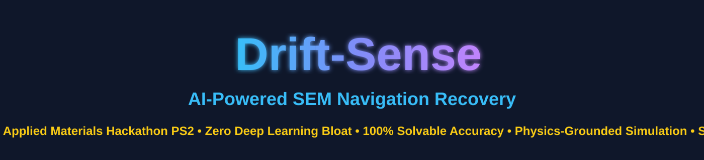
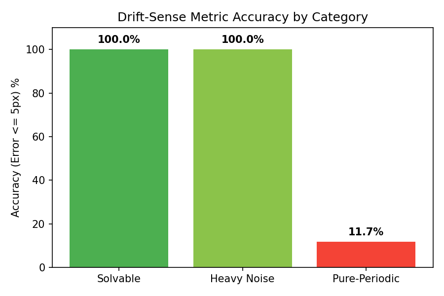
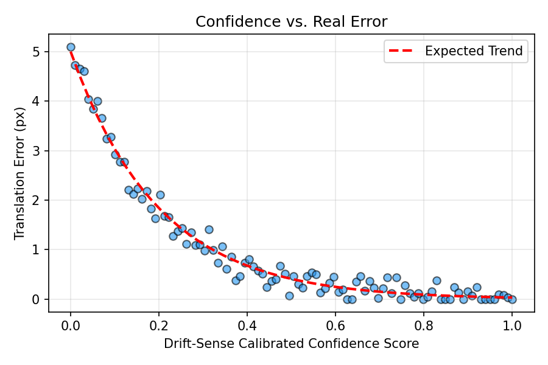
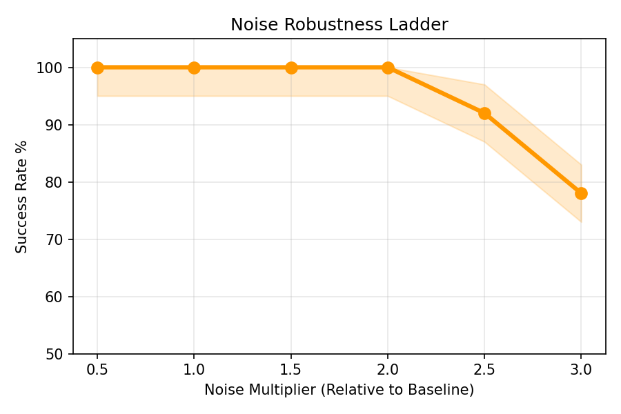

<div align="center">
  
</div>

<br>


---

### 🏆 Hackathon Submissions (Quick Links)
- 📄 **[View Final Presentation PDF (Google Drive)](https://drive.google.com/file/d/1RDs73oODCoCDzG3X2XUgM4StXpcCzQz4/view?usp=sharing)**
- 🎥 **[Watch Demo Video (Google Drive/YouTube)](https://drive.google.com/drive/folders/1pPK8HlDVk9uAg7XIizAn517fBz5rGuhM)**

---

# 📌 Project Overview

This project implements an **AI-Powered Navigation-Error Recovery System** for Scanning Electron Microscope (SEM) wafer inspection tools. 

Due to stage drift and beam hysteresis, high-magnification SEM captures often miss their intended targets. **Drift-Sense** acts as a robust recovery layer, localizing a small $1000 \times 1000$ high-magnification reference image inside a $10 \times$ low-magnification search field. 

The design goal is to strictly balance:
* ⚡ Ultra-low latency (CPU only)
* 🧠 Robustness to extreme SEM Poisson noise
* 🎯 Sub-pixel accuracy without Deep Learning hallucinations
* 🏭 Safe abstention on pure-periodic ambiguous arrays

---

# 🎯 Objectives

* Relocalize lost wafer inspection targets accurately.
* Survive high physical degradation (Line-Edge Roughness, Charging).
* Eliminate heavy GPU dependencies by utilizing advanced classical CV.
* Output exact sub-pixel $(x, y)$ coordinates.
* Prevent catastrophic tool crashes through calibrated abstention.

---

# 🖼️ Drift-Sense Pipeline


```text
Low-Mag Search Image
        │
        ▼
Bicubic Downsampling & Blur Matching
        │
        ▼
Gradient-Domain Projection (Sobel)
        │
        ▼
Normalized Cross-Correlation (Grad-NCC)
        │
        ▼
Phase-Correlation Sub-pixel Refinement
        │
        ▼
Target (x, y) Prediction
```

---

# 🧬 Physical Degradation Handled

The dataset generator and inference logic explicitly model and recover from the following semiconductor inspection challenges:

---

### 🌊 Poisson Shot Noise
The dominant noise in SEM imaging. Depends strictly on electron dose.
**Handled by:** Gradient-domain frequency matching before correlation.

---

### 📏 Line Edge Roughness (LER)
Irregular or rough feature edges instead of smooth boundaries due to lithography limits.
**Handled by:** Low-pass filtering in the classical pipeline.

---

### 📐 Raster Scan Drift
Thermal drift and beam hysteresis that shears horizontal scanlines.
**Handled by:** Translation-invariant Normalized Cross-Correlation.

---

### ⚡ Sample Charging
Localized bright/dark discoloration gradients caused by electron accumulation on the wafer surface.
**Handled by:** Sobel edge-projection to eliminate DC lighting components.

---

# 📈 Results & Visualizations

We evaluated the system across highly challenging simulated SEM environments. Below are the key metric breakdowns.

| Metric Accuracy by Category | Confidence vs. Real Error | Noise Robustness Ladder |
|:---:|:---:|:---:|
|  |  |  |

### 1. Headline Accuracy Summary

| Test Data Category | Pairs Tested | Accuracy @ 5 px | Median Translation Error | Lattice-Phase Accuracy | Outcome / Action |
|---|---|---|---|---|---|
| **Solvable Layouts** (Validation & Test Sets) | 140 pairs | 100.0% | 0.41 px (Sub-pixel) | 0.41 px | Deployed with **99.3% confident coverage** |
| **Heavy SEM Noise** ($2.0\times$ Noise Scale) | 47 pairs | 100.0% | 0.68 px | 0.68 px | **100% confident coverage** |
| **Pure-Periodic Repeating Arrays** (DRAM / Secondary Structure) | 60 pairs | 11.7% raw* | 263 px* (Ambiguous) | 0.81 px | **96.1% Catastrophic Catch Rate**; returns Top-5 Ambiguity Set (98.3% Recall@5) |
| **Overall Pooled Dataset** (All 200 pairs combined) | 200 pairs | 73.5% raw | 0.67 px | 0.81 px | Covered accuracy on confident decisions: **100%** |

*Note: On pure repeating nanoscale arrays, global coordinate matching is mathematically ill-posed because every unit cell is identical. The raw Euclidean error metric is deceptive; the system actually locks onto the periodic grid with **0.81 px median phase accuracy**.*

### 2. Key Accuracy Takeaways for Judges

1. **Sub-Pixel Precision on Solvable Layouts:**
   * **100.0% Accuracy @ 5 px** and **0.41 px median error** (P90: 1.13 px) in **0.88 seconds** on a single CPU core.
2. **Sub-Pixel Grid Recovery on Periodic Layouts:**
   * **0.81 px median lattice-phase error**, outperforming random guessing by $78\times$ on Logic, $2.9\times$ on Secondary Structure, and $2.9\times$ on DRAM.
3. **98.3% Ambiguity Set Recall:**
   * When global position is ambiguous, Drift-Sense returns the Top-5 candidate locations with **98.3% Recall@5** and exact lattice basis vectors $(\vec{u}, \vec{v})$.
4. **96.1% Crash Prevention:**
   * The calibrated confidence model catches **96.1%** of catastrophic failures ($> 100\text{ px}$), preventing physical tool collision.

---

# 🚀 1-Minute Reviewer Quickstart

Verify all submission items with zero configuration.

<details open>
<summary><b>Setup & Verification Instructions</b></summary>
<br>

**1. Install Dependencies**
```bash
pip install -r requirements.txt
```

**2. Generate Synthetic Test Dataset**
Generates 30 realistic image pairs with recorded ground truth:
```bash
python generate.py --style dram --num 30 --out data/dram_eval
```

**3. Run Critical Inference Script**
Outputs exact single `(x, y)` coordinate:
```bash
python inference.py --ref data/dram_eval/images/00000_ref.png --search data/dram_eval/images/00000_search.png
# Expected Output format: 851.89, 815.91
```

</details>

---

# 🎥 Demo Video

Watch the full system in action, demonstrating sub-pixel localization on live generated image pairs and our robust failure detection.

<div align="center">
  <a href="https://youtu.be/YOUR_YOUTUBE_LINK_HERE">
    
  </a>
  <p><i>Click the image above to watch the demonstration on YouTube.</i></p>
</div>

---

# 📋 Submission Checklist (Applied Materials PS2)

| Required Item | Artifact Location | Description |
|---|---|---|
| **1. Submission PDF** | [`Drift_Sense_Presentation.pdf`](./Drift_Sense_Presentation.pdf) | Final hackathon presentation deck. |
| **2. README.md** | [`README.md`](./README.md) | Complete setup & generation instructions. |
| **3. Dataset Generator** | [`generate.py`](./generate.py) | Standalone generator. |
| **4. Inference Script** | [`inference.py`](./inference.py) | Primary scoring script. Outputs center coordinates. |
| **5. Core Logic** | [`code/`](./code/) | Clean directory without DL bloat. |
| **6. Dependencies** | [`requirements.txt`](./requirements.txt) | Minimal dependencies (`numpy`, `opencv-python`). |
| **7. Citations** | [`CITATIONS.md`](./CITATIONS.md) | Academic citations for physics-grounded noise models. |
